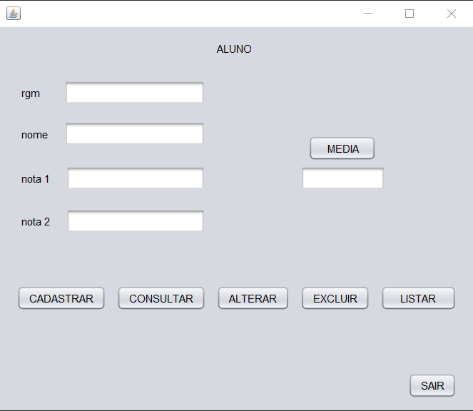

<h1 align="center"> CRUD-NotaAluno </h1>

Software com CRUD e Media dos alunos.  

  <a href="#-tecnologias">Tecnologias</a>&nbsp;&nbsp;&nbsp;|&nbsp;&nbsp;&nbsp;
  <a href="#-projeto">Projeto</a>&nbsp;&nbsp;&nbsp;|&nbsp;&nbsp;&nbsp;
  <a href="#memo-licença">Licença</a>

  

 

  

## 🚀 Tecnologias

Esse projeto foi desenvolvido com as seguintes tecnologias:

- Apache NetBeans IDE 17(Java)
- JFrame Form
- MySQl Workbench 8.0 CE(Necessario criar o banco de dados com as tabelas necessarias)
- XAMPP Control Panel(Port:3306 or 3307)

## 💻 Projeto

Software sobre um crud com java usando mysql e xampp, com foco principalmente na API JDBC.

## :memo: Licença

Esse projeto está sob a licença MIT.
